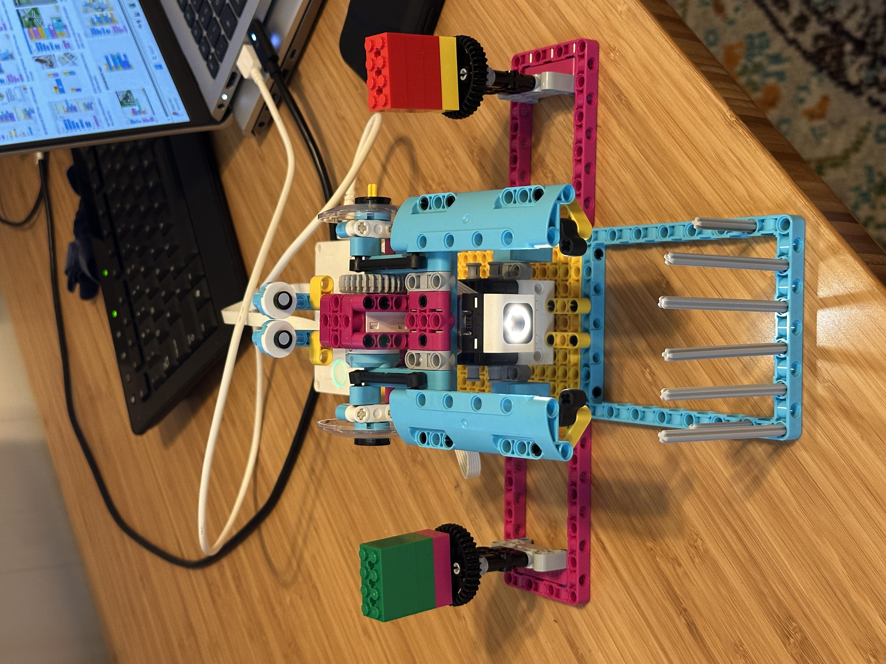

# lego-spike-grabber_thing
grab green/hulk blocks or red/flash blocks and drop in prison
see pic below!

References:
1. hardware/block design inspired by https://youtu.be/9p44swxSanM?si=ClEU0ij-HsQjQr3M
2. spike code conversion https://github.com/astrospark/flippertools/tree/main

   followed installation directions and then opened terminal in extracted zippertools dir and ran command
   ```
   .\flipper2text grabber_thing.llsp3 grabber_thing.txt

Some tweaks:
1. This version has a lower placement of color sensor - more reliable given the distance to the blocks/prisoners.
2. Also added eyes


